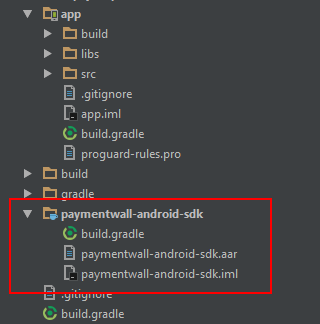
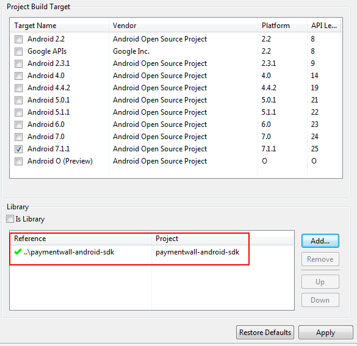
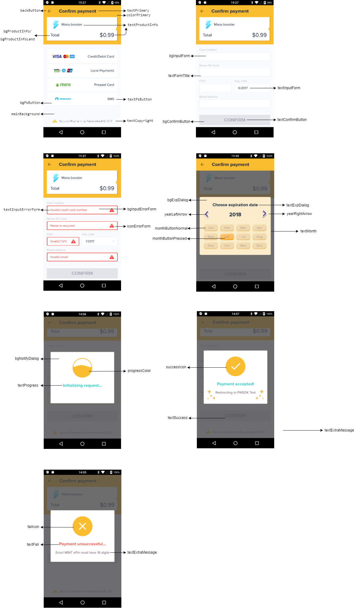

# Coresdk integration instruction

## ADD CORE SDK
### Android Studio
From your project, create a new module from paymentwall-android-sdk.aar


After that add this line in your app module's build.gradle:
```java
compile project(':paymentwall-android-sdk')
```
### Eclipse 
Extract paymentwall-android-sdk.zip and import the project into your workspace. And add this as your main project's library.



### Declare required permission
```java
<uses-permission android:name="android.permission.INTERNET" />
<uses-permission android:name="android.permission.ACCESS_WIFI_STATE" />
<uses-permission android:name="android.permission.ACCESS_NETWORK_STATE" />
<uses-permission android:name="android.permission.READ_PHONE_STATE" />
```

### Declare required activity
```java
<activity
   android:name="com.paymentwall.pwunifiedsdk.core.PaymentSelectionActivity"
   android:configChanges="keyboard|keyboardHidden|orientation|screenSize"
   android:theme="@style/PaymentwallSDKTheme"
   android:windowSoftInputMode="stateVisible|adjustResize|adjustPan" />
```
### Import needed classes to your app activity
```java
import com.paymentwall.pwunifiedsdk.core.PaymentSelectionActivity;
import com.paymentwall.pwunifiedsdk.core.UnifiedRequest;
import com.paymentwall.pwunifiedsdk.util.Key;
import com.paymentwall.pwunifiedsdk.util.ResponseCode;
```
### Define the request from your activity
```java
UnifiedRequest request = new UnifiedRequest();
```
### Set payment params
```java
request.setPwProjectKey(Constants.PW_PROJECT_KEY);
request.setPwSecretKey(Constants.PW_SECRET_KEY);
request.setAmount(good.getPrice());
request.setCurrency(good.getCurrency());
request.setItemName(good.getName());
request.setItemId(good.getId());
request.setUserId(Constants.USER_ID);
request.setSignVersion(3);
request.setItemResID(good.getImage());
request.setTimeout(30000);
```
``` setTimeout(int timeout)```: set max duration for request (in milliseconds)

Set item’s image: Refer this

### Add Brick payment method
```java
request.addBrick();
```
### Brick payment flow
When brick token is successfully obtained inside the sdk, a broadcast intent will be sent to merchant’s app.
You need to register for a broadcast receiver in your activity/service to get the token sent from the sdk:
```java
BroadcastReceiver receiver = new BroadcastReceiver() {
   @Override
   public void onReceive(Context context, Intent intent) {
       if (intent.getAction().equalsIgnoreCase(getPackageName() + Brick.BROADCAST_FILTER_MERCHANT)) {
           String brickToken = intent.getStringExtra(Brick.KEY_BRICK_TOKEN);
          //process your business logic

       }
   }
};
```

Then you can use brickToken to [create a charge](https://www.paymentwall.com/en/documentation/Brick/2968#create-a-charge). And then pass the result back to our sdk

```java
Brick.getInstance().setResult(result, token);
```
```result```: 1 or 0 (success or failed)
```token```: the permanent token from charge object you get if the charge is success.


If [3ds step is required](https://www.paymentwall.com/en/documentation/Brick/2968#3d-secure), you need to obtain the 3ds url from the response and send it back to the sdk:
```java
Brick.getInstance().setResult(form3ds);
```

### Card scanner plugin
You can let users using their phone camera to scan credit card for number, CVV, expired date automatically by compiling our cardIO plugin. Please refer the [integration guide](https://github.com/paymentwall/paymentwall-android-sdk/tree/master/Plugin/CardScanner)

### Add Mint payment method
```java
request.addMint();
```
### Add Mobiamo payment method
Declare required permissions in AndroidManifest
```java
<uses-permission android:name="android.permission.SEND_SMS" />
<uses-permission android:name="android.permission.READ_SMS" />
<permission
   android:name="${applicationId}.mobiamo.PAYMENT_BROADCAST_PERMISSION"
   android:label="Request for sending mobiamobroadcast to Mobiamo"
   android:protectionLevel="signature" />

<uses-permission android:name="${applicationId}.mobiamo.PAYMENT_BROADCAST_PERMISSION" />
```

Declare Mobiamo activity and broadcast receiver
```java
<receiver
   android:name="com.paymentwall.pwunifiedsdk.mobiamo.core.MobiamoBroadcastReceiver"
   android:exported="false"
   android:permission="${applicationId}.mobiamo.PAYMENT_BROADCAST_PERMISSION">
   <intent-filter>
       <action android:name="com.paymentwall.mobiamosdk.SENT_SMS_ACTION"></action>
   </intent-filter>
</receiver>

<activity
   android:name="com.paymentwall.pwunifiedsdk.mobiamo.core.MobiamoDialogActivity"
   android:configChanges="orientation|keyboardHidden|screenSize"
   android:theme="@android:style/Theme.Translucent.NoTitleBar" />
```
Add mobiamo from UnifiedRequest object
```java
request.addMobiamo();
```
### Add PwLocal payment method
Firstly, you have to create a [PwLocal request](https://www.paymentwall.com/en/documentation/PWLocal-Android-SDK/3018#create-a-request). Then set it to UnifiedRequest object:
```java
request.setPwlocalRequest(customRequest);
```
Finally, enable PwLocal option:
```java
request.addPwLocal();
```
### Set item image for the request
There are some data types of an item’s image you can pass to Paymentwall SDK. You can choose one in 4 below options:
```java
//From url
setItemUrl(String itemUrl);

//From file
setItemFile(File itemFile);

//From resource
setItemResID(int itemResID);

//Content provider(image's URI converted to string)
setItemContentProvider(String itemContentProvider);
```
### Add custom parameters
Paymentwall Android Sdk  allows to add extra parameters which can be used for later pingback. 
Example code:
```java
request.addCustomParam("timeStamp", System.currentTimeMillis() / 1000 + "");
request.addCustomParam("own_order_id", "o123456");
request.addCustomParam("shopname", "ecopark");
```
Multiple parameters are supported.

### Launch the SDK
```java
Intent intent = new Intent(getApplicationContext(), PaymentSelectionActivity.class);
intent.putExtra(Key.REQUEST_MESSAGE, request);
startActivityForResult(intent, PaymentSelectionActivity.REQUEST_CODE);
```
### Handle the callback
Paymentwall SDK callback falls in ```onActivityResult(int requestCode, int resultCode, Intent data)```
Result code is one of those constants in ResponseCode class.
```java
switch (resultCode) {
   case ResponseCode.ERROR:
       // There is an error with the payment
       break;
   case ResponseCode.CANCEL:
       // User cancels the payment
       break;
   case ResponseCode.SUCCESSFUL:
       // The payment is successful
       break;
   case ResponseCode.FAILED:
       // The payment was failed
       break;
   case ResponseCode.MERCHANT_PROCESSING:
       // This case is only for Brick. If nativeDialog set to false,
       // means that merchant displays successful payment dialog by himself
       // so the sdk will return brick token and this resultCode to merchant app
       break;
   default:
       break;
}
```

## EXTERNAL PAYMENT SYSTEMS INJECTION
Paymentwall SDK supports external payment system injection (which are in our defined payment system (PS) list). Each time you import an external PS, all you need to do are adding that native sdk (if available) of PS and our adapter (produced for that one) to your project, make the params and then pass to our core Sdk.

Add compilation lines for external ps sdk and adapter in your main app module build.gradle file
```java
compile project(':pandappsdk')
compile project(':alipayadapter')
compile files('libs/alipaySdk-20160825.jar')
```
### Initialize an external PS and add to UnifiedRequest
```java
public ExternalPs(String id , String displayName, int iconResId, Serializable params)
```
```id```: payment system’s id, as defined in this.
```displayName```: label of the ps displayed on the button.
```iconResId```: PS logo resource id.,
```Params```: parameters object passed to core sdk (varies among different PS).
Add external ps object to UnifiedRequest object.
```java
request.add(ps1, ps2,...);
```

## UI CUSTOMIZATION
There are two ways for UI modification that Paymentwall Sdk supports: apply our provided UI plugins or your custom android theme.
### UI plugins
You can refer [this link](https://github.com/paymentwall/paymentwall-android-sdk/tree/master/Plugin/UIPlugin) for UI plugins provided by us. The integration is simple. Import the plugin to your project and add it as a dependency of your app module like usual. Then add a line after initializing UnifiedRequest object.
Example with gameUI:
```java
request.setUiStyle("game");
```
### Custom theme
Firstly, create a new style in your styles.xml
```java
<style name="PwsdkCustomTheme" parent="@style/PaymentwallSDKTheme">
</style>
```
with PaymentwallSDKTheme is the default theme for the sdk.

We support the changeable components as in the list below:
```java
        <attr name="colorMain" format="color" />
        <attr name="textMain" format="color" />
        <attr name="mainBackground" format="integer" />
        <attr name="bgProductInfo" format="color" />
        <attr name="bgProductInfoLand" format="color" />
        <attr name="textProductInfo" format="color" />
        <attr name="bgPsButton" format="integer" />
        <attr name="textPsButton" format="color" />
        <attr name="textCopyright" format="color" />
        <attr name="bgInputForm" format="integer" />
        <attr name="bgInputErrorForm" format="integer" />
        <attr name="textInputForm" format="color" />
        <attr name="textInputErrorForm" format="color"/>
        <attr name="iconErrorForm" format="integer"/>
        <attr name="textFormTitle" format="color" />
        <attr name="bgConfirmButton" format="integer" />
        <attr name="textConfirmButton" format="color" />
        <attr name="backButton" format="integer"/>
        <attr name="bgExpDialog" format="color"/>
        <attr name="textExpDialog" format="color"/>
        <attr name="monthButtonNormal" format="integer"/>
        <attr name="monthButtonPressed" format="integer"/>
        <attr name="textMonth" format="color"/>
        <attr name="yearLeftArrow" format="integer"/>
        <attr name="yearRightArrow" format="integer"/>
        <attr name="bgNotifyDialog" format="color"/>
        <attr name="progressColor" format="color"/>
        <attr name="successIcon" format="integer"/>
        <attr name="failIcon" format="integer"/>
        <attr name="textProgress" format="color"/>
        <attr name="textSuccess" format="color"/>
        <attr name="textFail" format="color"/>
        <attr name="textExtraMessage" format="color"/>
```
 

You can modify any component you want by adding it in your custom style.
Example:
```java
<style name="PwsdkCustomTheme" parent="@style/PaymentwallSDKTheme">
        <item name="colorMain">@color/baseRedFont</item>
        <item name="textMain">@color/white</item>
        <item name="mainBackground">@color/pw_secondary_color</item>
        <item name="bgProductInfo">@color/pw_primary_color</item>
        <item name="bgProductInfoLand">@color/pw_primary_color</item>
        <item name="textProductInfo">#FF0000</item>
    </style>
```
Finally, apply the theme for PaymentSelectionActivity in the AndroidManifest.xml:
```java
<activity
      android:name="com.paymentwall.pwunifiedsdk.core.PaymentSelectionActivity"
      android:configChanges="keyboard|keyboardHidden|orientation|screenSize"
      android:windowSoftInputMode="stateVisible|adjustResize|adjustPan"
      android:theme="@style/PwsdkCustomTheme"
      tools:replace="android:theme"/>
```
Declare tools namespace in the manifest tag:
```java
<manifest 
    ...  
    xmlns:tools="http://schemas.android.com/tools">
```
